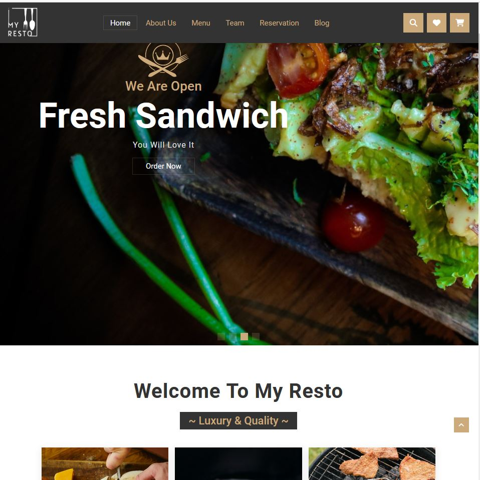

 

  

  <h3 align="center">My Resto Chingu Solo Project</h3>

  

    An Awesome restaurant website template made with only HTML, CSS & JavaScript!
     
     
    <a href="https://github.com/Swastik-Chakravorty/Chingu-solo-project-My-Resto-website-template"><strong>Explore the repo »</strong></a>
     
     
    <a href="https://twitter.com/swastikstwt" target="blank">My Twitter</a>
    .
    <a href="https://linkedin.com/in/swastikchakravorty" target="blank">My LinkedIn</a>
  

## Table Of Contents

* [About the Project](#about-the-project)
* [Built With](#built-with)
* [Getting Started](#getting-started)
  * [Prerequisites](#prerequisites)
  * [Installation](#installation)
* [Usage](#usage)
* [Roadmap](#roadmap)
* [Contributing](#contributing)
* [License](#license)
* [Authors](#authors)
* [Acknowledgements](#acknowledgements)

## About The Project

This is a one-page restaurant website template created entirely using HTML, CSS, and JavaScript. The template scrolls smoothly and has an active navbar link with scroll enabled. Just look at the website template; I'm sure you'll like it.

Here's features:

* On the Home page, you'll find four slideshow wallpapers.
* On the About Us section, the pictures are enlarged on hover.
* On the Food Menu section, there are four sections, each with two detailed items and prices.
* On the Team section, chef pictures are feature enabled, and on hover, the details of the chef with name, position, and social contact came up.
* On the Reservation section, there is a form with Book Now functionality.
* On the Blog section, the pictures are enlarged on hover.
* The footer section is featured with a newslatter subscription and copyright disclaimer.

## Built With

This website is built with simple HTML, CSS and JavaScript.
1. used CDN Font Awesome to use the required icons
2. used 'Roboto', sans-serif font-family
3. added menu toggle with javascript
4. made slides using swiperjs swiper slider autoplay
5. made scrolling in CSS using the "scrolling smooth" feature
6. Enable the active navbar link when scrolling with JavaScript

### Prerequisites

It is recommended to use "Mozilla Firefox" or "Google Chrome" for better resolution, but the website is built to view in any browser.

## Usage

You can use this template for any business, whether it is a restaurant, travel, showroom, appointment, or any other business.

## Contributing

Contributions for the betterment of this website are always welcome.

## Authors

* **Swastik Chakravorty** - *Self-taught Software Developer* - [Swastik Chakravorty](https://github.com/Swastik-Chakravorty) - *Built My Resto Restaurant Website Template*

## Acknowledgements

* [Chingu](https://github.com/chingu-voyages)
*Thank you, Chingu, for inspiring me to build this awesome restaurant website template for Chingu's solo project*
